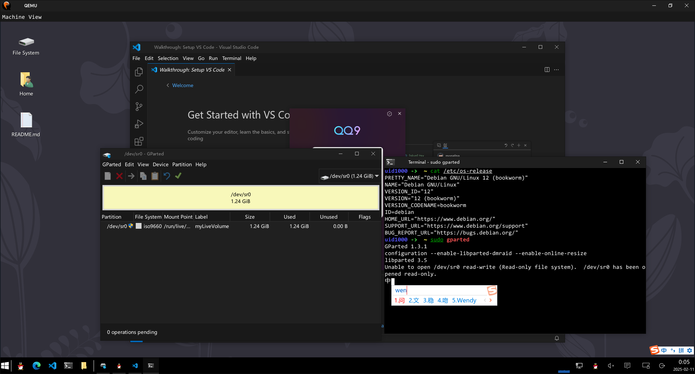

# Debian PE

自行配置的易用的 Debian PE(Debian Linux livecd)

## 1. 特色

主要特色：

- 预装 QQ、vscode、输入法等常用软件，便于随时随地使用。
- 预装 gparted、grub 多种系统修复工具，便于修复损坏的系统。
- 支持无线网络连接，兼容多种硬件和虚拟机平台。
- 配置了友好的使用环境，方便轻松使用。
- 可以自定义系统配置，方便个性化使用。
- 支持中英文环境，方便国内用户。

## 2. 快速开始

参考 2.1 节下载链接，下载最新版本，刻录到 U 盘即可启动。开机后会自动登录到一个用户，无需输入用户名（uid1000）和密码。

你也可以制作多启动盘，参考我的博客 [https://blog.csdn.net/m0_57309959/article/details/136288940](https://blog.csdn.net/m0_57309959/article/details/136288940)

### 2.1 发布版本与下载链接

下载链接：REC网盘 [https://rec.ustc.edu.cn/share/15411d10-dcaa-11ee-9e6b-c93c9d13a29e](https://rec.ustc.edu.cn/share/15411d10-dcaa-11ee-9e6b-c93c9d13a29e)

发布版本：

|文件名|大小|md5校验|
|--|--|--|
|debian-livecd-2025.iso|1157165056B，<1104MB，<1.08GB|8267d7d4dff1118fa967d668ff9348c5|

kali 版暂未发布，需要等待 kali 2025.1 发布。下载链接里目前那个是 2024 年预览版。

### 2.2 预装软件

本系统已预装并配置好：

- QQ、vscode、edge 浏览器、搜狗输入法等常用软件
- vim、cmake、gcc、tldr 等开发工具
- hardinfo、gparted 等系统修复工具
- 常见网卡驱动等固件和对应系统软件。

### 2.3 用户管理

本机包括 `root` 用户（密码为 `sudo`）和 `uid1000`（没有密码）两个用户。开机后自动登录 `uid1000` 并可以免密码执行 sudo 命令。

### 2.4 系统安装

如果你喜欢我的系统，可以把我的系统安装到本地磁盘作为日常使用。参考 [安装文档](./doc/desktop-README.md#3-安装系统)

### 2.5 自行配置

如果你喜欢我的系统，并且希望做一些定制，可以考虑阅读 [DIY文档](./doc/diy.md) 进行定制。

## 3. 基本信息

系统基本信息：

- 架构：amd64, x86_64
- 发行版：Debian 12.9
- 内核版本：6.1.0
- 图形桌面：xfce4
- 登录管理器：lightdm（已配置为自动登录）

## 4. 发布记录

### 4.0 预览版（2024 年发布）

包含 `Debian(12.5)`、`kali(2024.1 core)` 和 `kali(2024.1 default)` 三个版本。

[链接](https://blog.csdn.net/m0_57309959/article/details/135875827)，已弃用

### 4.1 2025 版

包含 `Debian(12.9)`，kali 需要等待 2025.1 发布。

相比于 2024 年第一次发布，本次升级了：

- 软件升级到最新版本，并修复已知错误。
- 兼容性得到了最终解决：
  - 网络：添加了完整的网络驱动，增强自动网络配置的兼容性。
    - 可以正常连接有线网和无线网（大部分 PE 不支持）
    - 在作者家里和朋友的多台电脑测试良好。
    - 仍然有少数老旧或罕见硬件不支持：[列表](./doc/unsupported-hardware.md)
  - 图形：增强图形显示兼容性。
    - 可以适应多种屏幕尺寸。
  - 虚拟机：增加 VMWare、VirtualBox 和 qemu 的兼容性。
- 体积缩小，不到上一次的三分之二，功能不变。
  - 体积不足 1104MB，不足 1.08 GB
  - 为缩小体积，我删除了没有用的语言包、文档、装饰等。
  - 因此系统只能在简体中文和英文环境下使用
- 开源构建方法，提升自动化构建水平。
- 在系统配置标准化和自动化方面有巨大提升。
  - 得益于 deepseek 和通义千问的帮助，本次发布极大提升标准化程度，取消了用户预定义文件，全部迁移到系统配置内。
  - 提供完整的构建方案，提供高度自动化的构建脚本。

## 5. 系统改动

Debian 是一个很干净的系统，为了使得其变得好用，我引入了一些闭源软件或其他改动。以下是部分改动：

- 修改 apt 源为[中科大源](https://mirrors.ustc.edu.cn/help/)（感谢中国科学技术大学开源软件镜像支持）。
- 安装一些常用软件。
- 安装了部分 intel cpu 和 nvidia 显卡的专有固件。
- 修改用户桌面，修改系统主题为类似 Windows 10 的主题。
- 修改用户终端为 zsh 并按照作者本人喜爱的方式进行配置。
- 修改常用编辑器、文字浏览器为 vim 并进行配置。
- 预装中文（简体和繁体）环境，但系统仍为英文。
- 添加字体 consolas 和 msyh，分别作为等宽字体和常用字体。

## 6. 构建

构建方法详见 [构建说明](./build/README.md)

## 7. 免责声明

本系统为计算机和 Linux 爱好者制作的免费工具，除非联系作者付费（联系：`i.k.u.n@qq.com`），否则不做任何商业用途。

本人未主观引入恶意程序或计算机病毒，如果是安装的某些软件自带病毒，那么请找到对应的软件提供者解决。

使用此操作系统时，请遵守相关国家或地区的法律规定，使用本系统造成的一切后果，作者不承担责任。如您在中国境内使用本系统，代表您已经充分了解相关法律内容，包括但不限于：

> 《中华人民共和国刑法》（部分）：
>
> - 第二百八十五条　违反国家规定，侵入国家事务、国防建设、尖端科学技术领域的计算机信息系统的，处三年以下有期徒刑或者拘役...
> - 第二百八十六条　违反国家规定，对计算机信息系统功能进行删除、修改、增加、干扰，造成计算机信息系统不能正常运行，后果严重的，处五年以下有期徒刑或者拘役；后果特别严重的，处五年以上有期徒刑...
> - 第二百八十七条　利用计算机实施金融诈骗、盗窃、贪污、挪用公款、窃取国家秘密或者其他犯罪的，依照本法有关规定定罪处罚...
