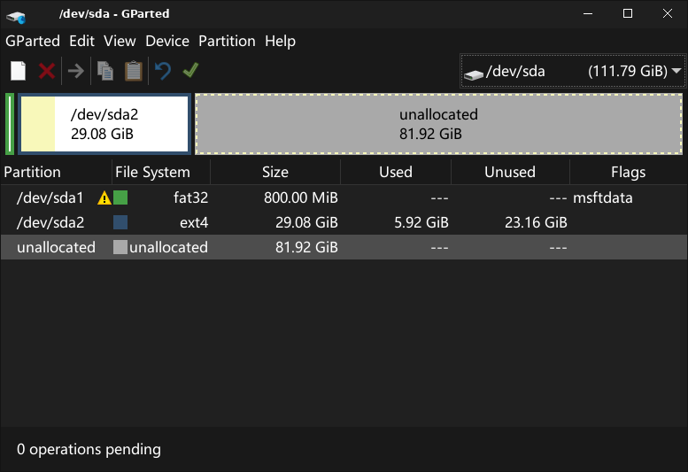

# 使用说明

本说明也存在于 Livecd 的桌面上。

## 1. 项目地址

- GitHub: [https://github.com/KZ25T/debian-PE](https://github.com/KZ25T/debian-PE)
- Gitee: [https://gitee.com/KZ25T/debian-pe](https://gitee.com/KZ25T/debian-pe)
- 联系作者、打赏：邮箱 `i.k.u.n@qq.com`

## 2. 快速开始

### 2.1 预装软件

本系统已预装并配置好：

- `QQ` `vscode` `firefox 浏览器` `搜狗输入法`等常用软件
- `vim` `cmake` `gcc` `tldr` 等开发工具
- `hardinfo` `gparted` 等系统修复工具
- `tar` `7z` 等压缩工具
- 常见网卡驱动等固件和对应系统软件

### 2.2 用户管理

本机包括 `root` 和 `uid1000`（都没有密码）两个用户。开机后自动登录 `uid1000` 并可以免密码执行 sudo 命令。

### 2.3 常用命令与快捷键

- 中文运行程序：在前边设置环境变量，如：`LANG=zh_CN.UTF-8 hardinfo`
- 设置桌面等显示配置：`xfce4-settings-manager`
- 命令行上网（上网备选方案）：`nmtui`
- 查看命令用法：`tldr`，如：`tldr tar`

部分快捷键：

- 显示桌面：`win(super)+D`
- 打开终端：`win(super)+R`
- 打开文件管理器：`win(super)+E`

### 2.4 自行配置

如果你喜欢我的系统，并且希望做一些定制，打开项目地址，找到 `doc/diy.md` 进行定制。

## 3. 安装系统

如果你喜欢我的系统，可以把我的系统安装到本地磁盘作为日常使用。您需要有一定的 Linux 知识以安装它，否则建议仍然按照[官网](https://www.debian.org/distrib/)并参考作者所写的[注意事项](https://blog.csdn.net/m0_57309959/article/details/135856767)安装。

**提醒：** 该功能尚未完善，本人测试过部分电脑，虽然理论上来讲应该没问题，但如果因操作不当造成损坏，请自己承担责任。

**提醒：** 这里的教程仅适用于 64 位计算机的 UEFI 启动（比较新的电脑应该都是这个）。对于比较老的系统可能需要自行安装 grub-pc 软件包。

以下以安装 debian 为例。首先启动本 LiveCD 操作系统。接下来你可以选择 [图形化安装](#31-可选图形化安装系统) 或 [手动安装](#32-可选手动安装系统)。对于新手来说，可以选择图形化安装。

> 挖坑：自己写一个 calamares-install-debian

### 3.1 （可选）图形化安装系统

图形化安装系统采取 Debian 官方提供的工具。本人测试数量较少，没有比较全部的测试，不保证成功，只讲述方法：

#### 3.1.1 安装软件

- 联网，`sudo apt update` 更新软件源。
- `sudo apt install calamares-settings-debian` 安装软件包。如果安装失败，可能需要首先 `sudo apt upgrade` 更新软件。
- `sudoedit /etc/calamares/modules/packages.conf` 把 remove 下面 `live-boot` 后边的内容全删掉。（会用 vim 吧？不会用的使用 `sudo mousepad` 替代 `sudoedit`）

#### 3.1.2 安装系统

断网并运行 `sudo install-debian`（或 `sudo calamares-install-debian`） 启动 Debian 安装器。

- `Location` 选上海（在地图上点出来，或者自己选）
    > Debian 官方在此处提供的地图不正确，作者本人不认可图中的中国国境线，正确的国境线请参考自然资源部的标准地图服务。此处仅作为教学讲解。
- `Partitions` 自己设置硬盘分区，记得挂载 EFI 分区。
  - 选择 `manual partitioning`
  - 一般一个几百兆到 1GB 左右的一个 FAT32 分区是 EFI 分区。点击该分区，下面点击 `edit`，确保 `Content` 是 `Keep` 然后 `Mount point` 选 `/boot/efi`
  - 然后选择根目录的分区。如果是之前已经空出来了一部分磁盘分区就点击 `Free Space` 之后下面 `Create` 新建，`content` 选 `Format`，`Mount Point` 选 `/`
- `Users` 自己设置用户名和密码。
- `Summary` 点击 `Next` 进入系统安装，进度条跑到 10~20 的时候在终端按下 `Ctrl+Z` 挂起，运行

  ```bash
  sudo cp /run/live/medium/live/vmlinuz /tmp/calamares-root-*/boot/vmlinuz-$(uname -r)
  sudo cp /run/live/medium/live/initrd.img /tmp/calamares-root-*/boot/initrd.img-$(uname -r)
  ```

  那个 `*` 参考你的自动补全，或者 `lsblk` 显示的挂载点。

  然后运行 `fg %1` 继续安装，安装完毕之后重启。

#### 3.1.3 其他设置

重启后你可能需要如下设置：

- 删除 livecd 专属配置：`sudoedit /etc/rc.local` 把 `exit 0` 上面的两行删掉。
- 运行 `sudoedit /etc/sudoers.d/nopasswd` 把 `uid1000` 改成你自己的名字。
- 运行 `sudoedit /etc/default/grub` 将 `GRUB_DISABLE_OS_PROBER` 后面的配置改为 `false`（如果那一行是被注释状态，这时候请取消前面的注释并修改为 `false`）然后 `sudo update-grub` 以添加其他系统。
- `kali` 安装之后，在启动页面里可能会显示为 Debian，这不要紧，会修的可以自己修。

接下来跳转 3.3 节。

### 3.2 （可选）手动安装系统

#### 3.2.1 硬盘分区

启动 GParted （命令：`sudo gparted`）给硬盘分区，给安装本系统划分出硬盘空间（至少一个 ext4 格式作为根目录分区），并挂载到 `/mnt/debian` 上。

- 提示：如果你的硬盘已经安装有 windows（windows 10 或 11）或 linux，那么硬盘上应该会有一个 ESP 分区（用 gparted 打开，上边显示标识为 boot, esp 等，格式是 fat32）；如果没有（比如说空硬盘），那么需要手动创建一个几百 MB （一般 260）的、格式为 fat32 的分区作为 ESP 分区；然后将你的 ESP 分区挂载到 `/mnt/debian/boot/efi` 上。
- **举例**：如果你的分区调整为：
  
  然后：
- 挂载根目录： `sudo mkdir -p /mnt/debian && sudo mount /dev/sda2 /mnt/debian`
- 挂载 ESP 分区： `sudo mkdir -p /mnt/debian/boot/efi && sudo mount /dev/sda1 /mnt/debian/boot/efi`

#### 3.2.2 复制文件

复制整个系统启动部分以外的内容：`sudo unsquashfs -dest /mnt/debian /run/live/medium/live/filesystem.squashfs`

> 注：`/run/live/medium/live` 这一套应该是启动时选择默认选项时的系统路径位置，如果你的启动选项不是默认选项，你可能需要通过 `lsblk` 查看挂载点。

安装内核：

- 复制内核：`sudo cp /run/live/medium/live/vmlinuz /mnt/debian/boot/vmlinuz-6.1.0-amd64`
- 复制 initramfs 文件：`sudo cp /run/live/medium/live/initrd.img /mnt/debian/boot/initrd.img-6.1.0-amd64`

#### 3.2.3 修复配置

- 进入 chroot：`sudo arch-chroot /mnt/debian`
- 删除 livecd 专属配置：`(chroot) vim /etc/rc.local` 把 `exit 0` 上面的两行删掉。
- 运行 `(chroot) passwd` 设置 root 密码。
- 运行 `(chroot) adduser --shell /bin/zsh <你的用户名>` 添加你自己的用户。
- 运行 `(chroot) rm /etc/lightdm/lightdm.conf.d/autoligin.conf`取消自动登录。
- 运行 `(chroot) vim /etc/sudoers.d/nopasswd` 把 `uid1000` 改成你自己的名字。
- 退出 chroot：ctrl+D

#### 3.2.4 设置挂载点

设置挂载系统：`sudo bash -c "genfstab -U /mnt/debian >> /mnt/debian/etc/fstab"`

#### 3.2.5 安装 grub 并配置引导

##### 3.2.5.1 如果您的硬盘已经有 grub

这种常见于你的电脑已经有一个 linux 操作系统，启动时会进入 grub 页面。这种情况下您不需要安装 grub，只需要：

- 卸载系统：`sudo umount /mnt/debian/boot/efi /mnt/debian`，然后重启回到原有的 linux 系统
- 配置系统探测：执行：
  - `vim /etc/default/grub` 将 `GRUB_DISABLE_OS_PROBER` 的那一行设置为 false（如果是被注释状态，这时候请取消前面的注释并修改为 false）
- 执行 `sudo update-grub`（有些发行版为 `grub-mkconfig -o /boot/grub/grub.cfg`）
- 重启，跳过 3.5.2 节

##### 3.2.5.2 如果您的硬盘没有 grub

这种常见于你的电脑可能只有一个 windows 10/11，此时需要安装 grub：

- 再次进入 chroot：`sudo arch-chroot /mnt/debian`
- 安装 grub：`(chroot) grub-install --target=x86_64-efi --boot-directory=/boot --efi-directory=/boot/efi <你的硬盘>（如 /dev/sda）`，如果是安装到移动硬盘上，需要加上参数 `--removable`
- 配置系统探测：如果你硬盘上还有其他操作系统，那么执行：
  - `(chroot) vim /etc/default/grub` 将 `GRUB_DISABLE_OS_PROBER` 的那一行设置为 false（如果是被注释状态，这时候请取消前面的注释并修改为 false）
- 配置 grub 文件：`(chroot) update-grub`
- 退出 chroot：ctrl+D
- 卸载系统：`sudo umount /mnt/debian/boot/efi /mnt/debian` 并重启。

### 3.3 你已经成功安装了系统

重启后安装必要软件、更新软件源和软件、安装全面的字体和驱动等。

推荐安装软件：

- 字体：`fonts-noto-mono`
- 声音：`pulseaudio` 和 `pavucontrol`
- 摄像：`cheese`
- 压缩文件查看：`engrampa`
- 聊天软件：微信（前往官网下载）

推荐安装驱动：

- 总成驱动（强烈推荐）：`firmware-linux`
- 显卡：`firmware-nvidia-graphics` `firmware-intel-graphics` 或 `firmware-amd-graphics` 选自己合适的。
- kali 用户：安装 `kali-linux-firmware kali-desktop-xfce` 模块化解决驱动问题。
- nvidia 加速计算：参考我的博客园 [https://www.cnblogs.com/KZ25T/p/18567357](https://www.cnblogs.com/KZ25T/p/18567357)
